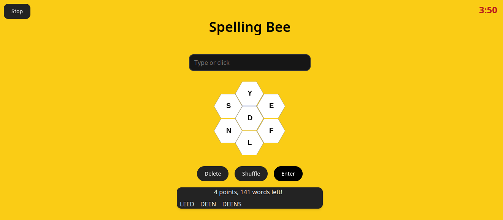

# SpellingBee: A Multiplayer Word Game

SpellingBee is a multiplayer word game built with React for the frontend and Django-Channels for the backend. The game allows two players to compete against each other in real-time, forming words from a set of letters. The app has been developed using Test-Driven Development (TDD) principles.

## Features

- Real-time multiplayer game with WebSocket communication
- Interactive game board with letter hive and player input
- Timer and scoring system
- Invitation and game setup for two players
- Error handling and notifications

## Technologies Used

### Frontend

- React
- TypeScript
- Vite
- Tailwind CSS
- Vitest and React Testing Library (for testing)

### Backend

- Django
- Django Channels

### Challenges
Though I had worked with Django and TDD before, this is my first websocket application. It came with some challenges: 

- Identifying Players and Associating Them with Game Instances:

To provide a good user experiencce, I wanted the players not to be forced to log in to the application. 
Instead, the react code generates, and stores in the brower's local storage, a unique identifier fo each player, and each game. The player's and game's UUID are used to generate the WebSocket URL.
Sending the player's UUID and the game ID as part of the WebSocket URL when establishing a connection.

- Developing a Multiplayer Game Timer:

To make the game more challenging, I created a countdown timer, which runs in a thread separated from the game tasks. It handles edge cases, such as players disconnecting or the game ending due to time running out or all guesses being exhausted

- Implementing WebSocket Security and Rate Limiting:

As Django Channels does not provide built-in rate limiting capabilities, I created a custom RateLimiter and imposed a limit on the maximum payload size. 

## Trying out the App locally

### Prerequisites

- Python (version 3.8 or higher)
- Node.js (version 14 or higher)

### Installation

1. Clone the repository:
`git clone https://github.com/gros-pataplouf/spelling-bee`

2. Navigate to the backend directory and install Python dependencies:
`cd backend`
`pipenv install`

3. Navigate to the frontend directory and install Node.js dependencies:
`cd ../frontend`
`npm install`

### Running the App

1. Start the Django server:
`cd backend`
`pipenv shell`
`python manage.py runserver`

2. In a separate terminal, start the Vite development server:

`cd frontend`
`npm run dev`

3. Open your web browser and navigate to `http://localhost:5173` to access the app.

