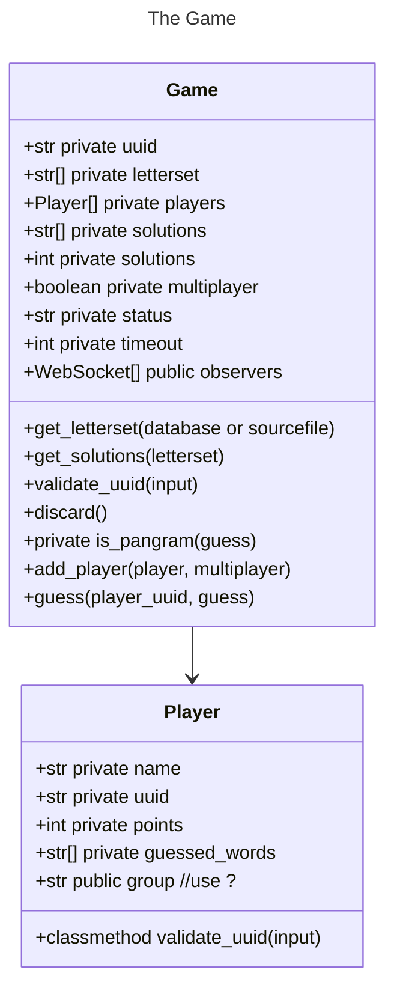

# Spelling-Py

Spelling-Py is an hommage and multi-player version of the [New York Time's Spelling Bee](https://nyt.com/spelling-bee).

```mermaid
---
title: The Game
---

 
classDiagram


    Player: +str private name
    Player: +str private uuid
    Player: +int private points
    Player: +str[] private guessed_words
    Player: +str public group //use ?
    Player: +classmethod validate_uuid(input)

    Game --> Player 
    Game: +str private uuid
    Game: +str[] private letterset
    Game: +Player[] private players
    Game: +str[] private solutions
    Game: +int private solutions
    Game: +boolean private multiplayer
    Game: +str private status
    Game: +int private timeout
    Game: +WebSocket[] public observers
    Game: +get_letterset(database or sourcefile)
    Game: +get_solutions(letterset)
    Game: +validate_uuid(input)
    Game: +discard()
    Game: +private is_pangram(guess)
    Game: +add_player(player, multiplayer)
    Game: +guess(player_uuid, guess)
    


```